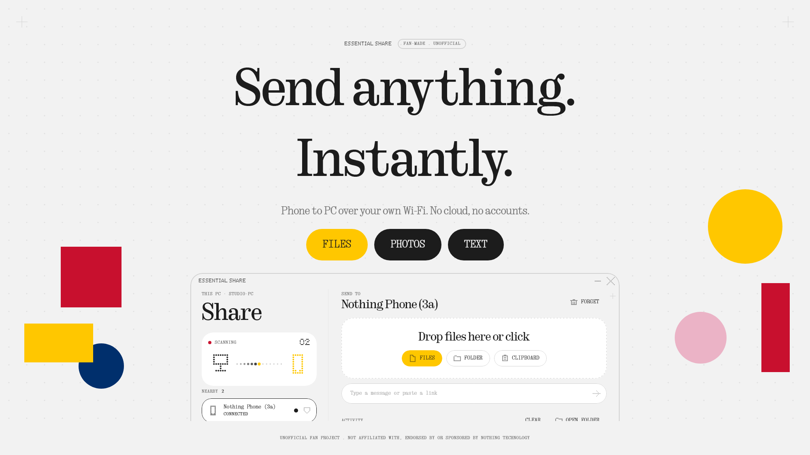

[English](README.md) | **Русский**

# Essential Share

> **Неофициальный проект энтузиаста.** Не связан с Nothing Technology Limited, не одобрен и не спонсируется ею. «Nothing», «Essential» и связанные названия принадлежат их владельцам.



Быстрая и приватная передача файлов и текста между Android-телефоном и Windows-ПК по локальной сети. Оформление в стиле Nothing / Essential: точечные подписи, серифные заголовки, один красный сигнал, по умолчанию тёмная тема.

Ничего не идёт через интернет и облачный диск: устройства общаются напрямую по Wi-Fi, поэтому скорость упирается только в роутер.

## Возможности

- **Само находит устройства** в одной сети Wi-Fi (UDP-маяк, без аккаунтов)
- **Сопряжение один раз** по 6-значному коду на обоих экранах (как в Bluetooth); дальше файлы от своих устройств принимаются сами
- **Файлы, папки, фото, текст и буфер обмена** в обе стороны, несколько файлов сразу, сегментированный прогресс и скорость
- **Android**: пункт в системном меню «Поделиться», плитка быстрых настроек отправляет буфер, тихая служба держит телефон доступным, файлы лежат в `Загрузки/Essential Share`
- **Windows**: перетаскивание или клик для выбора файлов, трей, синхронизация буфера, пункт в меню правой кнопки, автозапуск
- Тёмная, светлая или системная тема; интерфейс на русском и английском

## Безопасность

Каждое соединение начинается с взаимной проверки X25519 (временные и постоянные ключи смешиваются через HKDF), дальше трафик идёт в AES-256-GCM. 6-значный код выводится из рукопожатия, так что посредник покажет другой код. Пока оба человека не подтвердят пару, незнакомое устройство ничего отправить не может.

## Установка

### Windows

1. Скачайте `EssentialShare-Setup.exe` на странице [Releases](../../releases) и запустите. Права администратора не нужны: программа ставится в `%LOCALAPPDATA%\Programs\Essential Share`, добавляет ярлыки в меню «Пуск» и на рабочий стол и запись в *Параметры → Приложения*.
2. При первом запуске брандмауэр Windows спросит про доступ к сети. Разрешите **частные сети**, иначе ПК не сможет принимать файлы.
3. Удалить можно в любой момент через *Параметры → Приложения*. Настройки в `%APPDATA%\Essential Share` сохраняются.

### Android (14 и новее)

1. Скачайте `EssentialShare.apk` на странице [Releases](../../releases) и откройте его (если Android спросит, разрешите установку из этого источника).
2. Откройте приложение и разрешите уведомления. На Android 17+ ещё разрешите доступ к устройствам в локальной сети.
3. Чтобы приём работал в фоне, поставьте приложению расход батареи «Без ограничений».

## Как пользоваться

1. Подключите телефон и ПК к одной сети Wi-Fi (или ПК к точке доступа телефона).
2. Откройте Essential Share на обоих. Через пару секунд они появятся в списках друг у друга.
3. Нажмите на другое устройство и убедитесь, что на обоих экранах **один и тот же 6-значный код**. Это делается один раз.
4. Отправка:
   - **ПК → телефон:** перетащите файлы в окно, нажмите на зону загрузки или щёлкните файл правой кнопкой → *Отправить через Essential Share* (в Windows 11 пункт лежит в *Показать дополнительные параметры*).
   - **Телефон → ПК:** *Поделиться → Essential Share* в любом приложении или кнопка отправки внутри приложения.
   - **Буфер обмена:** меню в трее на ПК и плитка быстрых настроек на телефоне отправляют текст из буфера.
5. Полученное лежит в `Загрузки/Essential Share` на телефоне и в папке, указанной в настройках приложения на ПК. У завершённой передачи есть кнопки «Открыть» и «В папке».

Если устройства не видят друг друга: проверьте, что они в одной сети, что роутер не изолирует Wi-Fi-клиентов (AP isolation) и что у сети в Windows профиль «Частная». Запасной вариант: на ПК можно подключиться по адресу вида `ip:порт`.

## Сборка из исходников

Нужны: JDK 17; для APK ещё Android SDK (впишите `sdk.dir=...` в `local.properties`).

```
gradlew.bat :android:assembleRelease        # android/build/outputs/apk/release
gradlew.bat :desktop:createDistributable    # desktop/build/compose/binaries/main/app
gradlew.bat :core:test                      # тест протокола: сопряжение, 300 МБ, переподключение
gradlew.bat :desktop:renderPreview          # рисует экраны ПК в PNG без окна
powershell -File installer\build-installer.ps1   # упаковывает приложение в EssentialShare-Setup.exe
```

Скрипт установщика использует IExpress, он есть в Windows. Для релизного APK нужна своя подпись.

## Структура

- `core/`: протокол, шифрование, поиск устройств, передача (чистая JVM, общая для обоих приложений)
- `android/`: приложение на Jetpack Compose
- `desktop/`: приложение на Compose Desktop
- `installer/`: скрипты установки и удаления для текущего пользователя

Чего нет: передачи между разными сетями (оба устройства должны быть в одной сети Wi-Fi или на точке доступа), iOS и macOS.

## Шрифты

В репозитории лежат свободные замены (Oranienbaum, Geist Mono, MatrixSans Print, все под SIL OFL) с теми именами файлов, которые ждёт приложение:

- `desktop/src/main/resources/font/`: `NDot-55.otf`, `NType82-Headline.otf`, `NType82-Regular.otf`, `NType82Mono-Regular.otf`
- `android/src/main/res/font/`: `ndot_55.otf`, `ntype82_headline.otf`, `ntype82_regular.otf`, `ntype82mono_regular.otf`

Собственные шрифты Nothing (NDot и NType) здесь не распространяются. Если у вас есть право их использовать, положите их поверх этих файлов, чтобы получить полный вид.

## Лицензия

MIT, см. [LICENSE](LICENSE). Сторонние шрифты сохраняют свои лицензии (SIL OFL).
